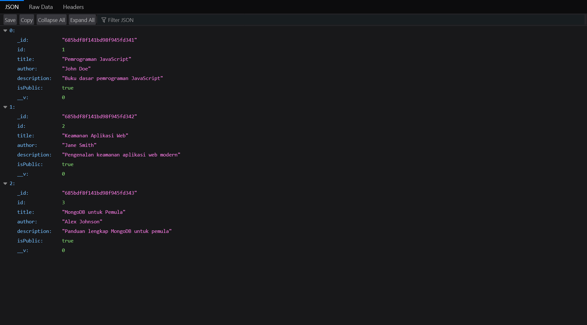
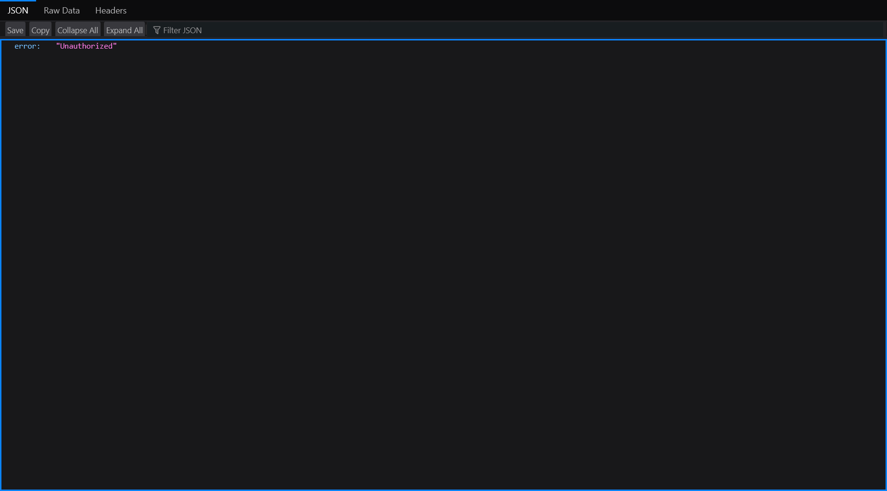
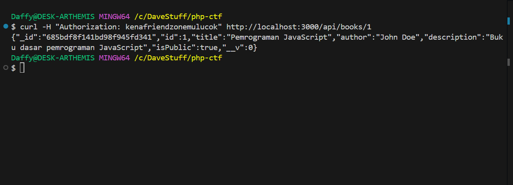
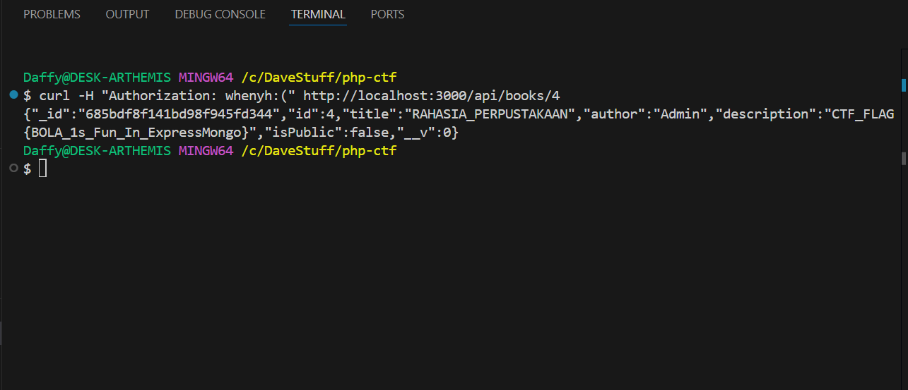

# Perpustakaan Hantu: CTF Challenge - Broken Object-Level Authorization

> Web CTF Challenge | by [ctflabs-id](https://github.com/ctflabs-id)


---

## 📖 Scenario

Anda adalah seorang cybersecurity analyst yang ditugaskan untuk menyelidiki kebocoran data di sistem perpustakaan digital "Perpustakaan Hantu". Sistem ini menggunakan Express.js dengan backend MongoDB. Telah ditemukan bahwa endpoint peminjaman buku membocorkan ID buku internal melalui kerentanan Broken Object-Level Authorization (BOLA).

---

## 🎯 Challenge Overview
**Target:** http://perpustakaan-hantu.local:3000<br>
**Vulnerability:** Broken Object-Level Authorization (BOLA/IDOR) pada endpoint peminjaman buku<br>
**Objective:** Temukan buku rahasia yang tersembunyi dengan judul "RAHASIA_PERPUSTAKAAN" dan dapatkan flag yang terdapat dalam deskripsi buku tersebut.<br>
**Difficulty:** ⭐⭐☆☆☆ (**Beginner**)

---
## 🛠️ Setup Instructions

Prerequisites:

    Node.js v14+
    MongoDB
    Postman/cURL (untuk testing)

Langkah-langkah:

  1. Clone repository ini
```bash
git clone https://github.com/ctflabs-id/perpustakaan-hantu-ctf.git
cd perpustakaan-hantu-ctf
```
  2. Install dependencies
```bash
npm install express mongoose body-parser
```
  3. Pastikan MongoDB Berjalan
  4. Start Server
```bash
node index.js
```
  5. Server akan berjalan di http://localhost:3000

---

## 💡 Hints

    🔍 Endpoint /api/books hanya menampilkan buku dengan isPublic: true
    🕵️‍♂️ Endpoint /api/books/:id memerlukan header Authorization tapi tidak memeriksa apakah user berhak mengakses buku tersebut
    🔢 ID buku bersifat sequential
    📕 Buku rahasia memiliki ID antara 1-5
    🚩 Flag format: CTF_FLAG{...}

---

## 🎓 Tujuan Tantangan Ini
  1. Belajar mengidentifikasi kerentanan Broken Object-Level Authorization
  2. Memahami pentingnya validasi otorisasi di level object
  3. Praktik enumerasi ID pada REST API
  4. Mengenal teknik eksploitasi IDOR

---

## ⚠️ Disclaimer

Challenge ini dibuat hanya untuk edukasi dan simulasi keamanan siber. Jangan gunakan teknik serupa terhadap sistem yang tidak kamu miliki atau tidak diizinkan.

---
<details><summary><h2>🏆 Solusi yang Diharapkan - (Spoiler Allert)</h2></summary>

Peserta harus:
    1. Melihat daftar buku publik melalui /api/books<br>
    
    2. Menemukan bahwa endpoint /api/books/:id ada tetapi membutuhkan header Authorization
    
    3. Menambahkan header Authorization sembarang (karena tidak divalidasi dengan benar)
    
    4. Melakukan brute-force pada ID 1-5 untuk menemukan buku rahasia
    
    Mendapatkan flag dari deskripsi buku dengan judul "RAHASIA_PERPUSTAKAAN"

<b>contoh exploit</b>
```bash
curl -H "Authorization: any_token_here" http://localhost:3000/api/books/4
```
> Flag: CTF_FLAG{CTF_CODES}
</details>

---

## 🤝 Kontribusi Pull request & issue welcome via: ctflabs-id/Perpustakaan-Hantu-CTF
## 🧠 Maintained by:
```
GitHub: @ctflabs-id
Website: ctflabsid.my.id
```


